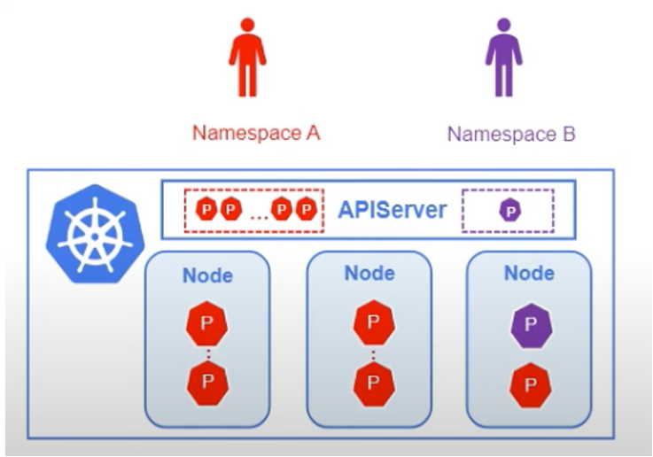
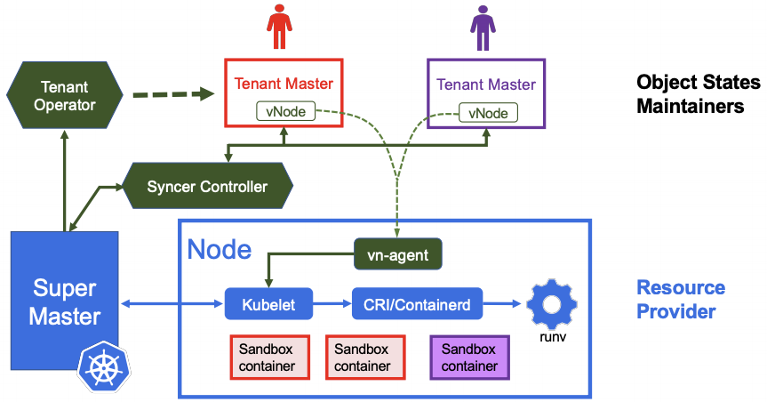
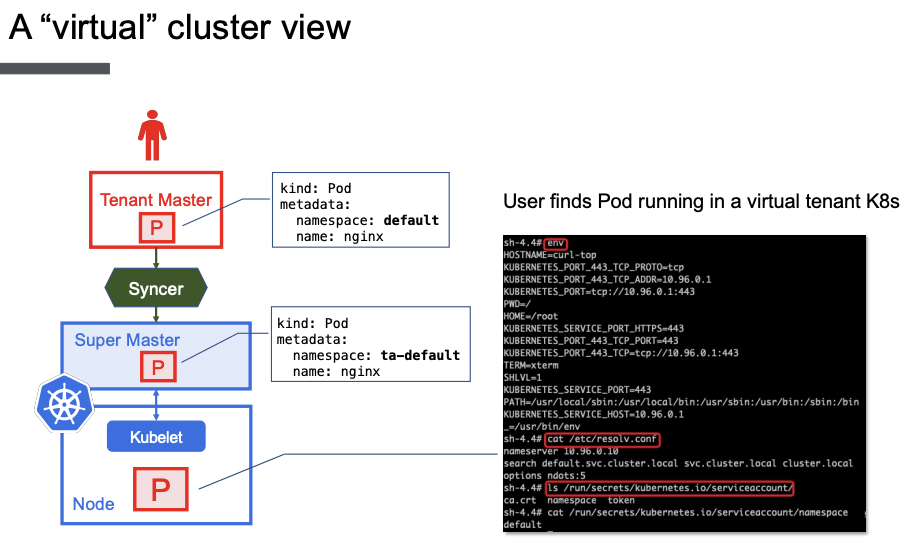
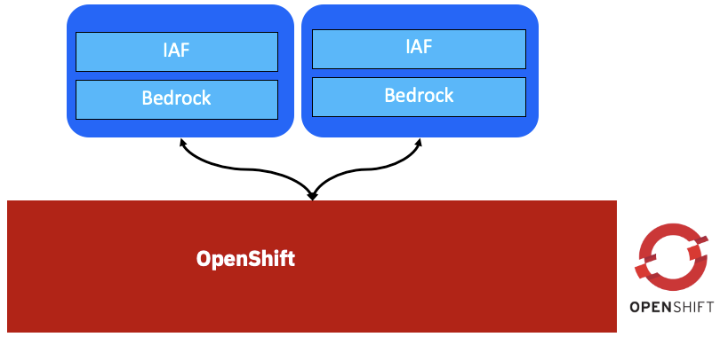
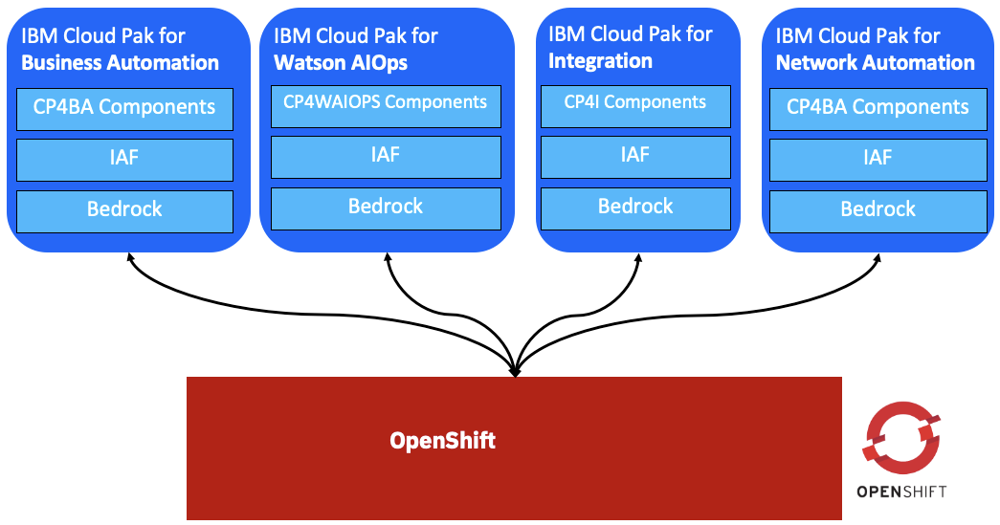

<!-- START doctoc generated TOC please keep comment here to allow auto update -->
<!-- DON'T EDIT THIS SECTION, INSTEAD RE-RUN doctoc TO UPDATE -->
**Table of Contents**  *generated with [DocToc](https://github.com/thlorenz/doctoc)*

- [VirtualCluster - Enabling Kubernetes Hard Multi-tenancy](#virtualcluster---enabling-kubernetes-hard-multi-tenancy)
  - [What is VirtualCluster](#what-is-virtualcluster)
  - [Why VirtualCluster](#why-virtualcluster)
  - [VirtualCluster Concepts](#virtualcluster-concepts)
    - [Super cluster](#super-cluster)
    - [Tenant cluster/Virtual cluster](#tenant-clustervirtual-cluster)
    - [Syncer controller](#syncer-controller)
    - [Vn-agent(Virtual node agent)](#vn-agentvirtual-node-agent)
    - [Tenant operator](#tenant-operator)
  - [Current PoC with Common Services and IAF](#current-poc-with-common-services-and-iaf)
    - [Created two tenant clusters](#created-two-tenant-clusters)
    - [VC1](#vc1)
    - [VC2](#vc2)
    - [Super Cluster](#super-cluster)
  - [Limitation for VirtualCluster](#limitation-for-virtualcluster)
  - [Plan](#plan)
  - [Reference](#reference)

<!-- END doctoc generated TOC please keep comment here to allow auto update -->

# VirtualCluster - Enabling Kubernetes Hard Multi-tenancy

## What is VirtualCluster

- VirtualCluster represents a new model to address Kubernetes control plane isolation challenges. It extends existing namespace based Kubernetes multi-tenancy model by providing each tenant a cluster view. 
- With VirtualCluster, each tenant is assigned a dedicated tenant control plane, which is a upstream Kubernetes distribution. 
- Tenants can create cluster scope resources such as namespaces and CRDs in the tenant control plane without affecting others. As a result, most of the isolation problems due to sharing one apiserver disappear. 
- The Kubernetes cluster that manages the actual physical nodes is called a super cluster, which now becomes a Pod resource provider. 
- Deployng multiple Tenant Cluster on one Super Kubernetes Cluster.

## Why VirtualCluster



- Performance
  - With namespace isolation, all components share one API Server.
  - If there are some buggie clients, it may occupy all resource of API Server which will cause the API Server does not work.
- Information leak
  - The namespace name may contain sensitive information, but once tenants are granted permission to list the namespaces to find their own ones, they can see all namespaces in the cluster.
- Management inconvenience
  - Tenants cannot freely create namespaces, clusterroles, or install custom resource definitions, and webhooks.
  - To work around such restrictions, tenants must go through rigorous negotiations with the cluster administrator.

## VirtualCluster Concepts



### Super cluster
- A cluster that actually manages and produces physical clusters

### Tenant cluster/Virtual cluster
- A virtual k8s cluster of the super cluster.
- Each tenant cluster will give independent and real kubernetes apiserver, controller manager, etcd as the tenant's exclusive k8s control plane.
- The control plane is independent, but it actually uses the physical resources of the super cluster, which are managed by the Super cluster.


### Syncer controller
- Populates the tenant objects used in Pod provision, such as namespaces, Pods, services, secrets,etc., to the super cluster.
- In Kubernetes, any namespace scoped object’s full name, i.e.,namespace name has to be unique. The syncer adds a prefix for each synchronized tenant namespace to avoid name conflicts.
- The prefix is the concatenation of the owner VC’s object name and a short hash of the object’s UID.

### Vn-agent(Virtual node agent)
- A proxy for the kubelet server api that running in the node, to support tenants to log in to the container and view logs, etc.
- When proxying the requests, vn-agent needs to identify the tenant because the tenant Pod has a different namespace in the super cluster.
- The tenant who sends the request can be found by comparing the hash of its TLS certificate with the one saved in each VC object. In Kubernetes, such as the super cluster in Virtual-Cluster, kubelet can only register itself to one apiserver.
- Implement a virtual node agent(vn-agent) to resolve this problem, which runs in every node to proxy tenants’ kubelet API requests.
### Tenant operator
- Creates apiserver, etcd and controller-manager Pods in local K8s cluster
- Manage the life cycle of the tenant cluster, stores the kubeconfig and the cluster access credential of each tenant control plane.

## Current PoC with Common Services and IAF

### Created two tenant clusters



```console
[root@box1 kubeconfig.unsteel]# kubectl get vc -A
NAMESPACE   NAME          AGE
default     vc-sample-1   4d8h
default     vc-sample-2   15h
```

### VC1

```console
[root@box1 kubeconfig.unsteel]# cat vc1.env
export KUBECONFIG=/root/kubeconfig.unsteel/vc-1.kubeconfig
oc config use-context default
oc cluster-info
```

```console
[root@box1 kubeconfig.unsteel]# . vc1.env
Switched to context "default".
Kubernetes master is running at https://10.22.40.132:30414
CoreDNS is running at https://10.22.40.132:30414/api/v1/namespaces/kube-system/services/kube-dns:dns/proxy

To further debug and diagnose cluster problems, use 'kubectl cluster-info dump'.
```
```console
[root@box1 kubeconfig.unsteel]# kubectl get po -n openshift-marketplace
NAME                                                              READY   STATUS                       RESTARTS   AGE
08a31ee1c1bc10ca6bc34a4ff7d037c4a85208925275fb09cd0e91e160lxzwn   0/1     Completed                    0          4d3h
099bc23fe6e9d877654ab7d3bc1b5c5c54cf34f84a45f91ed110f4d87dn8564   0/1     Completed                    0          4d6h
13ff1d957e79f0672c3f8117784125216832614398dba48894659d9650zpkww   0/1     Completed                    0          4d3h
1430dd7352a37bbf53fc9b23c35d440b312f3c9dba878f6d363984940djww8g   0/1     Completed                    0          4d3h
16c5c54021303f5b54b1377a472d624354ab3390fcbb092f4de36a63dd95fcl   0/1     Completed                    0          4d6h
171aa70e2c17e6df090904b08452a8d51dae0990842c31df6d18d00d51889g7   0/1     Completed                    0          13h
36c66f76a2f6568d42c6e5207b71695e708237bdbc365d63b0b055f857kngw2   0/1     Completed                    0          13h
3a07b1cdf50c8b36fbfa63c9b352cfee16c9676eb35202eff83cb7e045jqsm2   0/1     Completed                    0          13h
4581a748499df906076143bb1879fa64513694c4eb781a3401e753a08427g55   0/1     Completed                    0          13h
4a1d302721be1eafdc0afa16f20863fbc012e1df199950a9885829f0387rlfk   0/1     Completed                    0          4d6h
5197df68e8580d045514fc47f39222a250fb72ba538a21779aaba1a9d6p8mff   0/1     Completed                    0          4d6h
53106320eae423f6a284881690e92cde1762ce5c56bd933b4ab44928e16vqlk   0/1     Completed                    0          4d3h
5994737986963c14fd9d4a972f0ca57476aca98da94b39fbb9345e7223zgrjc   0/1     Completed                    0          13h
5ffbcdc524149cf75d5e64e84761d04ee40e088b032fbc7e8cc31d0990bmqjp   0/1     Completed                    0          4d6h
70c36eceb416a587d25e6d698021145f5fd1c433ef33d6417a4fc7e1514bnms   0/1     Completed                    0          13h
71ba06f86c3d726f0207621ce583e9dd926f84ff3b6fbbe1f00024786ehvvz6   0/1     Completed                    0          4d3h
ab3ec49aacdd1dbc9074aba5ef7474b458d4e0de7787bf760674715a7bdzwvp   0/1     Completed                    0          4d6h
c508e1da6e04d7ce2121c8d9992e824f2d36403c36799558411a3728eedct9m   0/1     Completed                    0          4d3h
c75decd0cbe6a5f6044ebb186695d044cb44ae1c1502ae6e9cc631263bspgh8   0/1     Completed                    0          13h
capability-operator-catalog-78h6p                                 1/1     Running                      0          4d6h
capability-operator-controller-manager-699f48887b-q42cq           1/1     Running                      7          4d3h
efed617aec34db68cb4c70a7315f92d51827a3d77f8ffc53b1e751f0026f22l   0/1     Completed                    0          4d3h
fdfeed2b5ee1e44bdf9efb4f21a4bb1f39fd6660ec959821e0649295c2m6grl   0/1     Completed                    0          4d6h
iaf-ai-operator-controller-manager-5d77f566df-m25sf               1/1     Running                      9          4d3h
iaf-core-operator-controller-manager-8547f4d88c-ld6zq             1/1     Running                      9          4d3h
iaf-core-operators-mqpd2                                          1/1     Running                      0          4d6h
iaf-eventprocessing-operator-controller-manager-6d6dc66fb59zfs4   1/1     Running                      10         4d3h
iaf-flink-operator-controller-manager-85df746d58-nmxlt            1/1     Running                      7          4d3h
iaf-operator-controller-manager-b9b68b598-588zk                   1/1     Running                      9          4d3h
iaf-operators-449d6                                               1/1     Running                      0          4d6h
ibm-cert-manager-operator-7bf88669b-wdpvt                         1/1     Running                      0          13h
ibm-common-service-operator-5f5494c477-smcfr                      1/1     Running                      0          4d3h
ibm-elastic-operator-controller-manager-5964db9cfd-v5nl6          1/1     Running                      9          4d3h
ibm-healthcheck-operator-57dc6855c9-9vq67                         1/1     Running                      0          16h
ibm-licensing-operator-6dc9f7f84c-sf66r                           1/1     Running                      0          13h
ibm-mongodb-operator-748c4dfb67-9bfkr                             1/1     Running                      0          13h
icp-memcached-58f7669974-q4mh8                                    0/1     CreateContainerConfigError   0          15h
icp-mongodb-0                                                     0/2     Init:1/2                     0          22h
must-gather-service-0                                             1/1     Running                      0          2d2h
opencloud-operators-mg47l                                         1/1     Running                      0          13h
system-healthcheck-service-d5cbf956d-vlbxl                        1/1     Running                      0          21h
```

### VC2
```console
[root@box1 kubeconfig.unsteel]# cat vc2.env
export KUBECONFIG=/root/kubeconfig.unsteel/vc-2.kubeconfig
oc config use-context default
oc cluster-info
```

```console
[root@box1 kubeconfig.unsteel]# . vc2.env
Switched to context "default".
Kubernetes master is running at https://10.22.40.132:31954
CoreDNS is running at https://10.22.40.132:31954/api/v1/namespaces/kube-system/services/kube-dns:dns/proxy

To further debug and diagnose cluster problems, use 'kubectl cluster-info dump'.
```
```console
[root@box1 kubeconfig.unsteel]# oc get po -n ibm-common-services
NAME                                                              READY   STATUS                       RESTARTS   AGE
099bc23fe6e9d877654ab7d3bc1b5c5c54cf34f84a45f91ed110f4d87d654tz   0/1     Completed                    0          49m
16c5c54021303f5b54b1377a472d624354ab3390fcbb092f4de36a63ddjmz8b   0/1     Completed                    0          49m
4a1d302721be1eafdc0afa16f20863fbc012e1df199950a9885829f038rjt5t   0/1     Completed                    0          49m
5197df68e8580d045514fc47f39222a250fb72ba538a21779aaba1a9d6pj5tx   0/1     Completed                    0          49m
5ffbcdc524149cf75d5e64e84761d04ee40e088b032fbc7e8cc31d0990brffx   0/1     Completed                    0          49m
capability-operator-catalog-pzdgw                                 1/1     Running                      0          50m
capability-operator-controller-manager-698d4f48d-4xdgt            1/1     Running                      0          49m
cert-manager-cainjector-5cc86f84f6-vw4sl                          1/1     Running                      0          32m
cert-manager-controller-6c567957f9-cm7rh                          1/1     Running                      0          32m
cert-manager-webhook-89c6fcc74-h8bwl                              1/1     Running                      0          32m
configmap-watcher-78c9bf9794-dvmh4                                1/1     Running                      0          32m
fac843f06676062417298fc208ebd425e6263b22c0c70cb7b9e0b89c9e9ktvt   0/1     Completed                    0          49m
fdfeed2b5ee1e44bdf9efb4f21a4bb1f39fd6660ec959821e0649295c2mtghh   0/1     Completed                    0          49m
iaf-ai-operator-controller-manager-5f574dd775-8ln4x               1/1     Running                      1          49m
iaf-core-operator-controller-manager-57578ccd7b-b87g8             1/1     Running                      1          49m
iaf-core-operators-dxksl                                          1/1     Running                      0          50m
iaf-eventprocessing-operator-controller-manager-6bb4545d7ftfvfv   0/1     CrashLoopBackOff             10         49m
iaf-flink-operator-controller-manager-794d55ff9d-2r9cz            1/1     Running                      0          49m
iaf-operator-controller-manager-68cc4cf4f7-lwh2p                  0/1     CrashLoopBackOff             10         49m
iaf-operators-hcfgv                                               1/1     Running                      0          50m
ibm-cert-manager-operator-5c65dfd584-sj9hw                        1/1     Running                      0          32m
ibm-common-service-operator-89b68785d-msqqw                       1/1     Running                      0          49m
ibm-common-service-webhook-7c858f996c-fktrh                       1/1     Running                      0          46m
ibm-elastic-operator-controller-manager-5f75977f8-796rc           0/1     CrashLoopBackOff             10         49m
ibm-healthcheck-operator-7c8944577f-pcvtc                         1/1     Running                      0          32m
ibm-licensing-operator-6dc89f94b5-6hpxd                           1/1     Running                      0          37m
ibm-mongodb-operator-659cbcdb55-dxlf5                             1/1     Running                      0          19m
ibm-namespace-scope-operator-67689f8757-qkqbp                     1/1     Running                      0          46m
icp-memcached-84f95dbc6d-mwhmx                                    0/1     CreateContainerConfigError   0          30m
icp-mongodb-0                                                     0/2     Init:0/2                     0          16m
must-gather-service-0                                             0/1     ContainerCreating            0          21m
opencloud-operators-bnc59                                         1/1     Running                      0          50m
operand-deployment-lifecycle-manager-6c55bff67d-kq9t6             1/1     Running                      0          45m
secretshare-59c658fd55-xdqtd                                      1/1     Running                      0          46m
system-healthcheck-service-855c67fb85-c7tk4                       1/1     Running                      0          30m
```

### Super Cluster

```console
[root@box1 kubeconfig.unsteel]# cat os.env
export KUBECONFIG=/root/.kube/config
oc cluster-info
```
```console
[root@box1 kubeconfig.unsteel]# . os.env
Kubernetes master is running at https://api.unsteel.cp.fyre.ibm.com:6443

To further debug and diagnose cluster problems, use 'kubectl cluster-info dump'.
```
```console
[root@box1 kubeconfig.unsteel]# oc get ns | grep default
default                                            Active   6d23h
default-489f96-vc-sample-1                         Active   4d8h
default-489f96-vc-sample-1-default                 Active   4d8h
default-489f96-vc-sample-1-ibm-common-services     Active   4d3h
default-489f96-vc-sample-1-kube-node-lease         Active   4d8h
default-489f96-vc-sample-1-kube-public             Active   4d8h
default-489f96-vc-sample-1-kube-system             Active   4d8h
default-489f96-vc-sample-1-olm                     Active   4d8h
default-489f96-vc-sample-1-openshift-marketplace   Active   4d7h
default-489f96-vc-sample-1-operators               Active   4d8h
default-6ba332-vc-sample-2                         Active   15h
default-6ba332-vc-sample-2-default                 Active   15h
default-6ba332-vc-sample-2-ibm-common-services     Active   15h
default-6ba332-vc-sample-2-kube-node-lease         Active   15h
default-6ba332-vc-sample-2-kube-public             Active   15h
default-6ba332-vc-sample-2-kube-system             Active   15h
default-6ba332-vc-sample-2-olm                     Active   15h
default-6ba332-vc-sample-2-openshift-marketplace   Active   15h
default-6ba332-vc-sample-2-operators               Active   15h
```

## Limitation for VirtualCluster

- All Cloud Paks need to run on OCP cluster.
- All Tenant Clusters are upstream Kubernetes API and Controller Manager.
- OCP also using Kube API Server and Controller Manager, but OCP SCC was not a upstream Kubernetes resources, need enable in Tenant Cluster.
## Plan



## Reference
- https://github.com/kubernetes-sigs/cluster-api-provider-nested/tree/main/virtualcluster
- https://github.com/kubernetes-sigs/cluster-api-provider-nested/blob/main/virtualcluster/doc/demo.md
- [VirtualCluster Box Folder in IBM](https://ibm.ent.box.com/folder/135211663122)
- https://github.com/kcp-dev/kcp/blob/main/docs/investigations/logical-clusters.md
