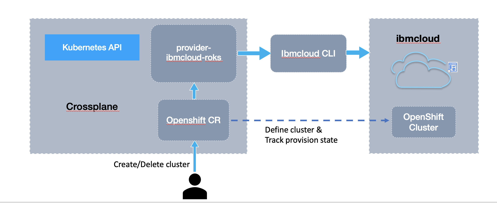
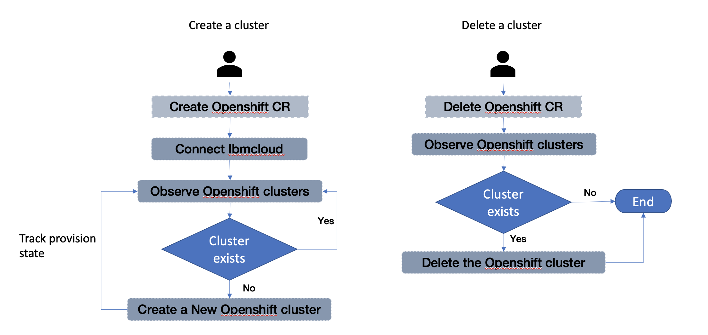

<!-- START doctoc generated TOC please keep comment here to allow auto update -->
<!-- DON'T EDIT THIS SECTION, INSTEAD RE-RUN doctoc TO UPDATE -->
**Table of Contents**  *generated with [DocToc](https://github.com/thlorenz/doctoc)*

- [Using Crossplane to Provision ROKS Cluster](#using-crossplane-to-provision-roks-cluster)
  - [Crossplane](#crossplane)
  - [Background](#background)
  - [Crossplane provision ROKS](#crossplane-provision-roks)
    - [Architecture](#architecture)
    - [Workflow](#workflow)
    - [How to Use Crossplane to Provision a ROKS Cluster](#how-to-use-crossplane-to-provision-a-roks-cluster)
    - [Source Code](#source-code)
  - [Future Plan](#future-plan)
    - [In IBM](#in-ibm)
    - [Open Source](#open-source)
  - [Reference](#reference)

<!-- END doctoc generated TOC please keep comment here to allow auto update -->

# Using Crossplane to Provision ROKS Cluster

## Crossplane

Checkout [Crossplane IBM Box Notes](https://ibm.ent.box.com/folder/129529271789) to get more detail.

## Background
- Crossplane is Cross Cloud Control Plane, it can fit into IBM Cloud Pak SaaS model well.
  - Crossplane can be used as control plan for SaaS.
    - Provision ROKS Cluster
    - Provision IBM Cloud Services, like sysdig etc
    - Install Cloud Paks
- Crossplane using providers to integrate with different providers, it is pretty simple to create a new provider by following the guidance.
  - [Crossplan Provider Template](https://github.com/crossplane/provider-template)

## Crossplane provision ROKS

`provider-ibmcloud-roks` is the Crossplane infrastructure provider for [ROKS in IBM Cloud](https://cloud.ibm.com).

### Architecture



### Workflow



### How to Use Crossplane to Provision a ROKS Cluster

step 1. Install [Crossplane](https://crossplane.io/docs/v1.1/getting-started/install-configure.html)

step 2. Install [IBM Cloud ROKS Provider](https://github.ibm.com/lyanwei/provider-ibmcloud-roks/blob/master/README.md)

step 3. Generate IBM Cloud API Key

Using an IBM Cloud account with permissions to manage IBM Cloud Services:

```shell
if [[ -z "${IBMCLOUD_API_KEY}" ]]; then
  echo "*** Generating new APIKey"
  IBMCLOUD_API_KEY=$(ibmcloud iam api-key-create provider-ibm-cloud-key -d "Key for Crossplane Provider IBM Cloud" | grep "API Key" | awk '{ print $3 }')
fi
```

step 4. Create a Provider Secret

```shell
kubectl create secret generic example-provider-secret --from-literal=credentials=${IBMCLOUD_API_KEY} -n crossplane-system
```

step 5. Configure the Provider

We will create the following ProviderConfig object to configure credentials for IBM Cloud Provider:

```yaml
apiVersion: roks.crossplane.io/v1alpha1
kind: ProviderConfig
metadata:
  name: example
spec:
  credentials:
    source: Secret
    secretRef:
      namespace: crossplane-system
      name: example-provider-secret
      key: credentials
```

step 6. Create/Delete an openshift cluster by following openshift.yaml

```yaml
apiVersion: openshift.roks.crossplane.io/v1alpha1
kind: OpenShift
metadata:
  name: example
spec:
  forProvider:
    clustertype: classic
    clustername: crossplane_test
    location: wdc04
    clusterversion: 4.5.35_openshift
    flavor: b3c.4x16.encrypted
    workers: "3"
    privateVlan: "2646907"
    publicVlan: "2646905"
  providerConfigRef:
    name: example
```

### Source Code

https://github.ibm.com/lyanwei/provider-ibmcloud-roks

## Future Plan
### In IBM
- Provision IBM Cloud Services, like sysdig etc
- Install Cloud Paks

### Open Source
- Contribute this to crossplane https://github.com/crossplane-contrib/provider-ibm-cloud

## Reference

Crossplane documentation: https://crossplane.io/docs/v1.1/
